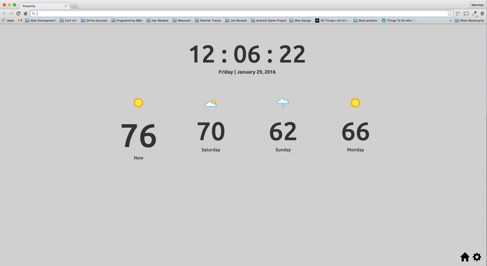

# Presently

A Google Chrome app that presents the weather based on the user's location. Built with [AngularJS](https://angularjs.org/), [ngRoute](https://code.angularjs.org/1.5.0-rc.2/angular-route.min.js) nad [SASS](http://sass-lang.com/).

Screenshot:

